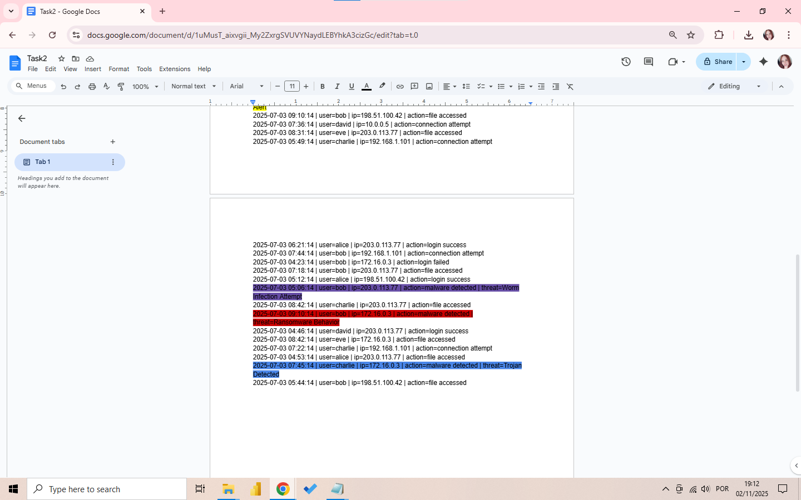

# FUTURE_CS_02
SOC Analyst Simulation: Security Operations Center task featuring log analysis, threat detection, and incident response reporting using cloud-based tools.

📋 About this Task:

This internship project provides a beginner-friendly introduction to Security Operations Center (SOC) core activities. The main role involves monitoring security alerts, analyzing potential threats, and simulating incident response - just like a real SOC analyst.

🔍 Key Features:

• Identify 3-5 suspicious alerts from security logs
• Incident classification by priority (High, Medium, Low)
• Detailed incident response report with timeline, impact, and remediation
• SIEM dashboard summary and analysis
• Online tool implementation 
 
## 🔍 Log Analysis in Google Docs

### First Step: Manual Threat Identification
I used Google Docs to analyze the security logs and identify suspicious activities through color-coding:

- 🟥 **RED** - Ransomware Behavior (HIGHEST priority)
- 🟧 **ORANGE** - Rootkit Signature (VERY HIGH priority)  
- 🟪 **PURPLE** - Worm Infection Attempt (HIGH priority)
- 🟨 **YELLOW** - Spyware Alert (MEDIUM priority)
- 🟦 **BLUE** - Trojan Detected (MEDIUM priority)

### Findings:
- Discovered 8 malware detection alerts across multiple users
- Identified 5 different types of cyber threats
- Noticed suspicious activity patterns from specific IP addresses

📋 Incident Response Report:
[Task2-Report.pdf](Task2-Report.pdf)

