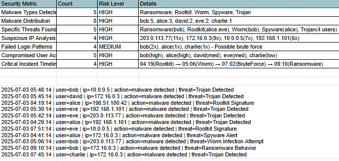

# FUTURE_CS_02
SOC Analyst Simulation: Security Operations Center task featuring log analysis, threat detection, and incident response reporting using cloud-based tools.

📋 About this Task:

This internship project provides a beginner-friendly introduction to Security Operations Center (SOC) core activities. The main role involves monitoring security alerts, analyzing potential threats, and simulating incident response - just like a real SOC analyst.

🔍 Key Features:

• Identify 3-5 suspicious alerts from security logs
• Incident classification by priority (High, Medium, Low)
• Detailed incident response report with timeline, impact, and remediation
• SIEM dashboard summary and analysis
• Online tool implementation 
 
## 🔍 Log Analysis in Google Docs

### First Step: Manual Threat Identification
I used Google Docs to analyze the security logs and identify suspicious activities through color-coding:

- 🟥 **RED** - Ransomware Behavior (HIGHEST priority)
- 🟧 **ORANGE** - Rootkit Signature (VERY HIGH priority)  
- 🟪 **PURPLE** - Worm Infection Attempt (HIGH priority)
- 🟨 **YELLOW** - Spyware Alert (MEDIUM priority)
- 🟦 **BLUE** - Trojan Detected (MEDIUM priority)

### Findings:
- Discovered 8 malware detection alerts across multiple users
- Identified 5 different types of cyber threats
- Noticed suspicious activity patterns from specific IP addresses

📋 Incident Response Report:
[Task2-Report.pdf](Task2-Report.pdf)

SIEM ANALYSIS REPORT: 

🔍 Alert Triage Process
Initial Review: Scanned 50+ security logs for suspicious patterns

Priority Filtering: Focused on "malware detected" and "login failed" events

Pattern Identification: Grouped alerts by user, IP, and threat type

Risk Assessment: Classified based on malware severity and spread

🚨 Threat Identification
Malware Analysis:
Ransomware: Critical - data encryption threat

Rootkit: Critical - system-level persistence

Worm: High - network propagation risk

Spyware: Medium - data exfiltration

Trojan: Medium - backdoor access

Network Threats:
IP 203.0.113.77: High risk - 11 occurrences, multiple attack types

Brute Force Patterns: 4 failed logins across 3 users

Lateral Movement: Multiple users accessing same suspicious IPs

📊 Incident Classification Criteria
HIGH PRIORITY:
Ransomware/Rootkit detection

Multiple malware types per user

High-frequency suspicious IPs (>5 occurrences)

MEDIUM PRIORITY:
Single Trojan/Spyware detection

Failed login attempts

Moderate IP suspiciousness (3-5 occurrences)

LOW PRIORITY:
Single connection attempts

Successful logins without malware

Normal file access

🛡️ SOC Response Actions
IMMEDIATE (0-2 hours):
Isolate infected machines: bob, alice, david, eve

Block malicious IPs at firewall

Reset compromised credentials

Initiate malware containment

SHORT-TERM (2-24 hours):
Full network scan for additional infections

User awareness notification

Backup verification for ransomware recovery

Security policy review

LONG-TERM (1-7 days):
Implement multi-factor authentication

Enhance endpoint protection

Conduct security training

Update incident response playbook

📈 Key Findings Summary
Attack Sophistication: Multi-vector attack (ransomware + rootkit + worm)

Compromise Scale: 5 users, 4 critical IPs, 5 malware types

Business Impact: High - data integrity and availability at risk

Response Urgency: Critical - immediate containment required

